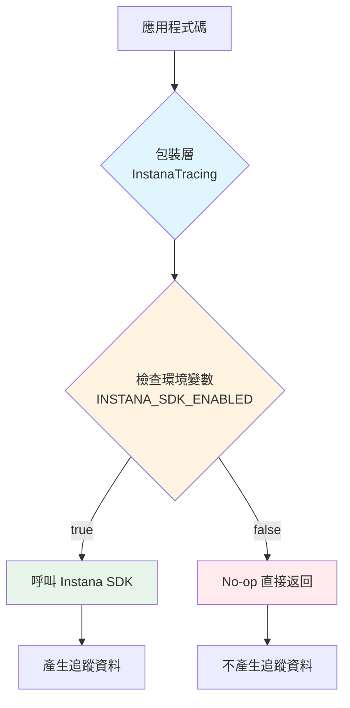

# Instana SDK 追蹤開關控制設計方案

## 專案現況分析

### 當前架構
- **部署環境**: JBoss Application Server
- **追蹤模式**: Java Agent + SDK 混合模式
- **SDK 使用統計**:
  - 44 處 `@Span` 註解
  - 60+ 處 `SpanSupport.annotate()` 呼叫
  - 19 個 Java 檔案涉及 SDK 使用
  - 2 個核心追蹤工具類:
    - [`InstanaTracing.java`](src/main/java/com/example/camping/observability/InstanaTracing.java)
    - [`InstanaTracingUtil.java`](src/main/java/com/example/camping/util/InstanaTracingUtil.java)

### 技術挑戰
1. **註解無法動態關閉**: `@Span` 註解在編譯時就已經嵌入,無法在執行時停用
2. **SDK 依賴性**: 程式碼直接呼叫 `SpanSupport.annotate()`,若 SDK 不存在會拋出 `NoClassDefFoundError`
3. **JBoss 環境限制**: 需要考慮 JBoss 的類別載入機制和部署特性

---

## 方案評估

### 方案 A: Maven Profile (編譯時決定)

#### 概述
使用 Maven Profile 在編譯時決定是否包含 Instana SDK 依賴,並透過條件編譯控制追蹤程式碼。

#### 優點
- ✅ 完全移除 SDK 依賴,WAR 檔案更小
- ✅ 無執行時效能損耗
- ✅ 不會有 `NoClassDefFoundError` 風險

#### 缺點
- ❌ **需要重新編譯**: 每次切換都要重新打包
- ❌ **需要維護兩套程式碼**: 使用條件編譯或介面抽象
- ❌ **部署複雜度高**: 需要管理多個 WAR 檔案
- ❌ **無法動態切換**: 不符合「不需重新編譯」的需求

#### 適用場景
適合長期固定使用或不使用 SDK 的情況,不適合需要頻繁切換的場景。

---

### 方案 B: 環境變數 + 執行時檢查 ⭐ **推薦方案**

#### 概述
保留 SDK 依賴,但在執行時透過環境變數控制是否執行追蹤邏輯。使用包裝層(Wrapper)模式隔離 SDK 呼叫。

#### 優點
- ✅ **最小改動**: 只需修改 2 個工具類
- ✅ **執行時切換**: 透過環境變數即可控制,無需重新編譯
- ✅ **JBoss 相容**: 完全相容 JBoss 環境變數機制
- ✅ **向後相容**: 不影響現有功能
- ✅ **易於測試**: 可以在不同環境輕鬆切換

#### 缺點
- ⚠️ SDK JAR 仍然包含在 WAR 中(約 50KB)
- ⚠️ `@Span` 註解仍會執行(但可透過 Agent 配置停用)
- ⚠️ 有輕微的條件判斷效能損耗(可忽略)

#### 適用場景
**最適合本專案**,滿足所有需求:最小改動、JBoss 相容、易於切換、不需重新編譯。

---

### 方案 C: JBoss 部署描述符配置

#### 概述
使用 JBoss 的 `jboss-deployment-structure.xml` 控制類別載入,動態排除 Instana SDK。

#### 優點
- ✅ 不需修改 Java 程式碼
- ✅ 透過部署描述符控制

#### 缺點
- ❌ **無法解決根本問題**: 程式碼仍會呼叫 SDK API,會拋出 `NoClassDefFoundError`
- ❌ **需要額外的錯誤處理**: 必須在所有 SDK 呼叫處加上 try-catch
- ❌ **維護困難**: 錯誤處理分散在 19 個檔案中
- ❌ **不優雅**: 依賴異常處理來控制功能

#### 適用場景
不適合本專案,會增加程式碼複雜度且容易出錯。

---

## 推薦方案詳細設計 (方案 B)

### 核心設計理念

採用 **包裝層模式 (Wrapper Pattern)** + **環境變數控制**:

```
應用程式碼
    ↓
InstanaTracing / InstanaTracingUtil (包裝層)
    ↓
檢查環境變數 INSTANA_SDK_ENABLED
    ↓
├─ true  → 呼叫 Instana SDK API
└─ false → 直接返回 (no-op)
```

### 架構圖



---

## 實作細節

### 1. 環境變數定義

```bash
# 啟用 SDK 追蹤 (預設值)
INSTANA_SDK_ENABLED=true

# 停用 SDK 追蹤
INSTANA_SDK_ENABLED=false
```

### 2. 修改檔案清單

只需修改 **2 個檔案**:

1. [`src/main/java/com/example/camping/observability/InstanaTracing.java`](src/main/java/com/example/camping/observability/InstanaTracing.java)
2. [`src/main/java/com/example/camping/util/InstanaTracingUtil.java`](src/main/java/com/example/camping/util/InstanaTracingUtil.java)

### 3. InstanaTracing.java 修改方案

#### 修改內容

在類別開頭加入環境變數檢查:

```java
package com.example.camping.observability;

import com.instana.sdk.annotation.Span;
import com.instana.sdk.support.SpanSupport;

public final class InstanaTracing {
    
    // ========== 新增: SDK 開關控制 ==========
    private static final boolean SDK_ENABLED;
    
    static {
        String enabled = System.getenv("INSTANA_SDK_ENABLED");
        // 預設為 true,只有明確設定為 "false" 才停用
        SDK_ENABLED = !"false".equalsIgnoreCase(enabled);
        
        if (!SDK_ENABLED) {
            System.out.println("[INSTANA] SDK tracing is DISABLED via INSTANA_SDK_ENABLED=false");
        } else {
            System.out.println("[INSTANA] SDK tracing is ENABLED");
        }
    }
    
    /**
     * 檢查 SDK 是否啟用
     */
    public static boolean isSdkEnabled() {
        return SDK_ENABLED;
    }
    // ========== 新增結束 ==========
    
    // 常數定義保持不變
    public static final String ROOT_HTTP_SPAN = "camping-api-root";
    // ... 其他常數 ...
    
    private InstanaTracing() {
    }
    
    // ========== 修改所有公開方法,加入開關檢查 ==========
    
    public static void httpEntry(String spanName, String method, String path, int statusCode) {
        if (!SDK_ENABLED) return; // 新增這行
        
        annotate(Span.Type.ENTRY, spanName, "tags.http.method", method);
        annotate(Span.Type.ENTRY, spanName, "tags.http.url", "service://camping-api" + path);
        annotate(Span.Type.ENTRY, spanName, "tags.http.status_code", Integer.toString(statusCode));
        annotate(Span.Type.ENTRY, spanName, "tags.service", "camping-api");
        annotate(Span.Type.ENTRY, spanName, "tags.endpoint", method + " " + path);
    }
    
    public static void batchJob(String spanName, String jobName) {
        if (!SDK_ENABLED) return; // 新增這行
        
        annotate(Span.Type.ENTRY, spanName, "tags.batch.job", jobName);
        annotate(Span.Type.ENTRY, spanName, "tags.service", "camping-api");
        annotate(Span.Type.ENTRY, spanName, "tags.endpoint", jobName);
    }
    
    public static void kafkaExit(String topic, String key, String eventType) {
        if (!SDK_ENABLED) return; // 新增這行
        
        annotate(Span.Type.EXIT, KAFKA_SEND_SPAN, "tags.message_bus.destination", topic);
        // ... 其他程式碼保持不變 ...
    }
    
    public static void intermediate(String spanName, String key, String value) {
        if (!SDK_ENABLED) return; // 新增這行
        
        annotate(Span.Type.INTERMEDIATE, spanName, key, value);
    }
    
    public static void method(String spanName, String className, String methodName) {
        if (!SDK_ENABLED) return; // 新增這行
        
        method(Span.Type.INTERMEDIATE, spanName, className, methodName);
    }
    
    public static void method(Span.Type spanType, String spanName, String className, String methodName) {
        if (!SDK_ENABLED) return; // 新增這行
        
        annotate(spanType, spanName, "tags.java.class", className);
        annotate(spanType, spanName, "tags.java.method", methodName);
    }
    
    public static void entry(String spanName, String key, String value) {
        if (!SDK_ENABLED) return; // 新增這行
        
        annotate(Span.Type.ENTRY, spanName, key, value);
    }
    
    public static void error(Span.Type spanType, String spanName, Throwable throwable) {
        if (!SDK_ENABLED) return; // 新增這行
        
        annotate(spanType, spanName, "tags.error", "true");
        annotate(spanType, spanName, "tags.error.message", throwable.getMessage());
        annotate(spanType, spanName, "tags.error.type", throwable.getClass().getName());
    }
    
    // private 方法保持不變,因為只有內部呼叫
    private static void annotate(Span.Type spanType, String spanName, String key, String value) {
        SpanSupport.annotate(key, safe(value));
    }
    
    private static String safe(String value) {
        return value == null || value.isBlank() ? "unknown" : value;
    }
}
```

#### 修改說明

1. **新增靜態欄位**: `SDK_ENABLED` 在類別載入時讀取環境變數
2. **新增靜態初始化區塊**: 讀取環境變數並輸出狀態訊息
3. **新增公開方法**: `isSdkEnabled()` 供外部查詢狀態
4. **修改所有公開方法**: 在方法開頭加入 `if (!SDK_ENABLED) return;`

#### 修改行數統計

- 新增程式碼: ~20 行
- 修改現有方法: 8 個方法,每個加 1 行
- **總計**: 約 28 行程式碼修改

---

### 4. InstanaTracingUtil.java 修改方案

#### 修改內容

```java
package com.example.camping.util;

import com.instana.sdk.support.SpanSupport;
import java.util.function.Supplier;
import java.util.logging.Logger;

public class InstanaTracingUtil {
    private static final Logger LOGGER = Logger.getLogger(InstanaTracingUtil.class.getName());
    
    // ========== 新增: SDK 開關控制 ==========
    private static final boolean SDK_ENABLED;
    
    static {
        String enabled = System.getenv("INSTANA_SDK_ENABLED");
        SDK_ENABLED = !"false".equalsIgnoreCase(enabled);
    }
    // ========== 新增結束 ==========

    public static <T> T trace(String methodName, Supplier<T> supplier) {
        // 如果 SDK 停用,直接執行業務邏輯,不做追蹤
        if (!SDK_ENABLED) {
            return supplier.get();
        }
        
        // 以下程式碼保持不變
        long startTime = System.currentTimeMillis();

        SpanSupport.annotate("business.method.start", methodName);
        SpanSupport.annotate("business.timestamp.start", String.valueOf(startTime));

        try {
            T result = supplier.get();
            long duration = System.currentTimeMillis() - startTime;

            SpanSupport.annotate("business.method.end", methodName);
            SpanSupport.annotate("business.duration.ms", String.valueOf(duration));
            SpanSupport.annotate("business.status", "success");

            LOGGER.info(String.format("[INSTANA-TRACE] %s - SUCCESS - %dms", methodName, duration));
            return result;
        } catch (Exception e) {
            long duration = System.currentTimeMillis() - startTime;

            SpanSupport.annotate("business.method.end", methodName);
            SpanSupport.annotate("business.duration.ms", String.valueOf(duration));
            SpanSupport.annotate("business.status", "error");
            SpanSupport.annotate("business.error.type", e.getClass().getSimpleName());
            SpanSupport.annotate("business.error.message", e.getMessage() != null ? e.getMessage() : "");

            LOGGER.severe(String.format("[INSTANA-TRACE] %s - ERROR - %dms - %s",
                    methodName, duration, e.getMessage()));
            throw e;
        }
    }

    public static void traceVoid(String methodName, Runnable runnable) {
        trace(methodName, () -> {
            runnable.run();
            return null;
        });
    }

    public static void addBusinessTag(String key, Object value) {
        if (!SDK_ENABLED) return; // 新增這行
        
        if (value != null) {
            SpanSupport.annotate("business." + key, String.valueOf(value));
        }
    }

    public static void markStep(String stepName, String description) {
        if (!SDK_ENABLED) return; // 新增這行
        
        SpanSupport.annotate("business.step", stepName);
        SpanSupport.annotate("business.step.description", description);
        LOGGER.info(String.format("[INSTANA-STEP] %s: %s", stepName, description));
    }

    public static void logBusinessEvent(String eventType, String eventData) {
        if (!SDK_ENABLED) return; // 新增這行
        
        SpanSupport.annotate("business.event.type", eventType);
        SpanSupport.annotate("business.event.data", eventData);
        SpanSupport.annotate("business.event.timestamp", String.valueOf(System.currentTimeMillis()));
        LOGGER.info(String.format("[INSTANA-EVENT] %s: %s", eventType, eventData));
    }
}
```

#### 修改說明

1. **新增靜態欄位和初始化**: 與 `InstanaTracing` 相同的模式
2. **修改 `trace()` 方法**: 在開頭加入 SDK 停用檢查
3. **修改其他方法**: 在開頭加入 `if (!SDK_ENABLED) return;`

#### 修改行數統計

- 新增程式碼: ~8 行
- 修改現有方法: 4 個方法,每個加 1 行
- **總計**: 約 12 行程式碼修改

---

### 5. @Span 註解處理方案

#### 問題說明

`@Span` 註解無法在執行時動態停用,因為它是在編譯時就嵌入到位元組碼中的。

#### 解決方案

透過 **Instana Agent 配置** 來停用註解處理:

**修改 `instana-agent-config.json`**:

```json
{
  "com.instana.plugin.javatrace": {
    "instrumentation": {
      "sdk": {
        "enabled": false
      }
    }
  }
}
```

#### 工作原理

- 當 `sdk.enabled = false` 時,Instana Agent 不會處理 `@Span` 註解
- 註解仍然存在於程式碼中,但不會產生任何追蹤資料
- 這是 **Agent 層級的控制**,與應用程式碼無關

#### 優點

- ✅ 不需修改任何帶有 `@Span` 註解的程式碼
- ✅ 透過配置檔案控制,易於管理
- ✅ 可以與環境變數方案配合使用

---

### 6. 完整的開關控制策略

結合兩種機制,實現完整的追蹤控制:

| 控制層級 | 控制機制 | 影響範圍 | 配置方式 |
|---------|---------|---------|---------|
| **應用層** | 環境變數 `INSTANA_SDK_ENABLED` | `SpanSupport.annotate()` 呼叫 | JBoss 環境變數 |
| **Agent層** | Agent 配置 `sdk.enabled` | `@Span` 註解 | `instana-agent-config.json` |

#### 完全停用追蹤的步驟

1. 設定環境變數: `INSTANA_SDK_ENABLED=false`
2. 修改 Agent 配置: `sdk.enabled = false`
3. 重啟應用程式

---

## 部署流程

### 在 JBoss 環境中的部署步驟

#### 情境 1: 啟用 SDK 追蹤 (預設)

**步驟**:

1. **確保環境變數未設定或設為 true**:
   ```bash
   # Linux/Unix
   export INSTANA_SDK_ENABLED=true
   
   # Windows
   set INSTANA_SDK_ENABLED=true
   ```

2. **確保 Agent 配置啟用 SDK**:
   ```json
   {
     "com.instana.plugin.javatrace": {
       "instrumentation": {
         "sdk": {
           "enabled": true
         }
       }
     }
   }
   ```

3. **部署應用程式**:
   ```bash
   # 複製 WAR 到 JBoss deployments 目錄
   cp target/camping-api.war $JBOSS_HOME/standalone/deployments/
   ```

4. **啟動 JBoss**:
   ```bash
   $JBOSS_HOME/bin/standalone.sh
   ```

5. **驗證追蹤已啟用**:
   - 查看啟動日誌,應該看到: `[INSTANA] SDK tracing is ENABLED`
   - 檢查 Instana UI,應該能看到追蹤資料

---

#### 情境 2: 停用 SDK 追蹤

**步驟**:

1. **設定環境變數**:
   
   **方法 A: 在 JBoss 啟動腳本中設定** (推薦)
   
   編輯 `$JBOSS_HOME/bin/standalone.conf` (Linux) 或 `standalone.conf.bat` (Windows):
   
   ```bash
   # Linux: standalone.conf
   JAVA_OPTS="$JAVA_OPTS -DINSTANA_SDK_ENABLED=false"
   ```
   
   ```batch
   REM Windows: standalone.conf.bat
   set "JAVA_OPTS=%JAVA_OPTS% -DINSTANA_SDK_ENABLED=false"
   ```
   
   **方法 B: 在系統環境變數中設定**
   
   ```bash
   # Linux/Unix
   export INSTANA_SDK_ENABLED=false
   
   # Windows
   set INSTANA_SDK_ENABLED=false
   ```
   
   **方法 C: 在 JBoss 管理介面設定**
   
   透過 JBoss CLI:
   ```bash
   /system-property=INSTANA_SDK_ENABLED:add(value=false)
   ```

2. **修改 Agent 配置** (可選,但建議):
   
   編輯 `instana-agent-config.json`:
   ```json
   {
     "com.instana.plugin.javatrace": {
       "instrumentation": {
         "sdk": {
           "enabled": false
         }
       }
     }
   }
   ```

3. **重啟 JBoss**:
   ```bash
   $JBOSS_HOME/bin/jboss-cli.sh --connect command=:shutdown
   $JBOSS_HOME/bin/standalone.sh
   ```

4. **驗證追蹤已停用**:
   - 查看啟動日誌,應該看到: `[INSTANA] SDK tracing is DISABLED via INSTANA_SDK_ENABLED=false`
   - 檢查 Instana UI,應該看不到 SDK 產生的追蹤資料(只有 Agent 自動追蹤)

---

#### 情境 3: 動態切換 (不重啟應用程式)

**限制**: 由於環境變數在 JVM 啟動時讀取,**無法在不重啟的情況下切換**。

**替代方案**: 如果需要動態切換,可以考慮:

1. **使用配置檔案**: 將開關存在外部配置檔案中,定期重新載入
2. **使用 JMX**: 透過 JMX MBean 動態控制
3. **使用資料庫**: 將開關存在資料庫中,應用程式定期查詢

**注意**: 這些方案會增加複雜度,不符合「最小改動」原則,不建議採用。

---

### 部署檢查清單

#### 啟用追蹤時

- [ ] 環境變數 `INSTANA_SDK_ENABLED` 未設定或設為 `true`
- [ ] Agent 配置 `sdk.enabled` 設為 `true`
- [ ] Instana Agent 正在執行
- [ ] 應用程式啟動日誌顯示 `[INSTANA] SDK tracing is ENABLED`
- [ ] Instana UI 可以看到追蹤資料

#### 停用追蹤時

- [ ] 環境變數 `INSTANA_SDK_ENABLED` 設為 `false`
- [ ] Agent 配置 `sdk.enabled` 設為 `false` (可選)
- [ ] 應用程式已重啟
- [ ] 應用程式啟動日誌顯示 `[INSTANA] SDK tracing is DISABLED`
- [ ] Instana UI 看不到 SDK 追蹤資料

---

## 風險評估

### 1. 技術風險

#### 風險 1.1: 環境變數未正確設定

**描述**: 環境變數設定錯誤或未生效,導致追蹤狀態與預期不符。

**影響**: 中

**機率**: 低

**緩解措施**:
- 在應用程式啟動時輸出追蹤狀態訊息
- 提供明確的部署文件和檢查清單
- 在測試環境先驗證

**偵測方式**:
- 查看應用程式啟動日誌
- 檢查 Instana UI 是否有追蹤資料

---

#### 風險 1.2: @Span 註解仍然執行

**描述**: 即使設定 `INSTANA_SDK_ENABLED=false`,`@Span` 註解仍會執行。

**影響**: 低

**機率**: 高 (如果未配置 Agent)

**緩解措施**:
- 同時配置 Agent 的 `sdk.enabled = false`
- 在文件中明確說明兩層控制機制
- 提供完整的配置範例

**偵測方式**:
- 檢查 Instana UI 是否仍有 `@Span` 產生的追蹤資料
- 查看 Agent 日誌

---

#### 風險 1.3: 類別載入順序問題

**描述**: 在某些情況下,靜態初始化區塊可能在環境變數設定前執行。

**影響**: 低

**機率**: 極低

**緩解措施**:
- 環境變數在 JVM 啟動時就已設定,早於任何類別載入
- JBoss 的類別載入機制保證環境變數可用性
- 在多個環境測試驗證

**偵測方式**:
- 啟動日誌會顯示追蹤狀態
- 如果狀態不正確,會立即發現

---

### 2. 效能風險

#### 風險 2.1: 條件判斷的效能損耗

**描述**: 每次呼叫追蹤方法都會執行 `if (!SDK_ENABLED) return;` 判斷。

**影響**: 極低

**分析**:
- 這是一個簡單的布林值檢查,JVM 會高度優化
- 現代 JVM 的分支預測器會快取結果
- 相比於實際的追蹤操作,這個檢查的成本可忽略不計

**效能測試建議**:
```java
// 簡單的效能測試
long start = System.nanoTime();
for (int i = 0; i < 1_000_000; i++) {
    InstanaTracing.intermediate("test", "key", "value");
}
long duration = System.nanoTime() - start;
System.out.println("Duration: " + duration / 1_000_000 + "ms");
```

**預期結果**:
- SDK 啟用時: ~100-200ms (實際執行追蹤)
- SDK 停用時: ~1-2ms (只執行條件判斷)

---

#### 風險 2.2: SDK JAR 檔案仍在 WAR 中

**描述**: 即使停用追蹤,Instana SDK JAR (~50KB) 仍會包含在 WAR 檔案中。

**影響**: 極低

**分析**:
- 50KB 對現代應用程式來說微不足道
- 不會影響執行時效能(類別不會被載入使用)
- 只會略微增加部署時間(幾毫秒)

**緩解措施**:
- 如果真的需要移除,可以使用 Maven Profile 方案
- 但這會失去「不需重新編譯」的優勢

---

### 3. 功能風險

#### 風險 3.1: 對現有功能的影響

**描述**: 修改追蹤程式碼可能影響現有功能。

**影響**: 低

**機率**: 極低

**緩解措施**:
- 修改只在方法開頭加入條件判斷,不改變原有邏輯
- 預設行為保持不變(SDK 啟用)
- 完整的回歸測試

**測試策略**:
1. **單元測試**: 測試 `InstanaTracing` 和 `InstanaTracingUtil` 的所有方法
2. **整合測試**: 測試完整的請求流程
3. **效能測試**: 比較修改前後的效能
4. **A/B 測試**: 在測試環境同時執行修改前後的版本

---

#### 風險 3.2: 日誌輸出的影響

**描述**: `InstanaTracingUtil` 中的日誌輸出仍會執行,即使追蹤停用。

**影響**: 極低

**分析**:
- 日誌輸出對除錯很有幫助
- 效能影響可忽略不計
- 可以透過日誌級別控制

**建議**:
- 保持日誌輸出,方便監控和除錯
- 如果需要,可以在日誌輸出前也加入 SDK 檢查

---

### 4. 維護風險

#### 風險 4.1: 新增追蹤程式碼時忘記加入檢查

**描述**: 開發人員在新增追蹤程式碼時,可能忘記加入 SDK 檢查。

**影響**: 低

**機率**: 中

**緩解措施**:
- 在 `InstanaTracing` 和 `InstanaTracingUtil` 的 JavaDoc 中明確說明
- 提供程式碼範本和最佳實踐文件
- Code Review 時檢查
- 考慮使用 Checkstyle 或 PMD 規則自動檢查

**範例 JavaDoc**:
```java
/**
 * 記錄 HTTP 入口追蹤資訊
 * 
 * <p><b>注意</b>: 此方法會檢查 INSTANA_SDK_ENABLED 環境變數,
 * 如果設為 false,將不會執行任何追蹤操作。
 * 
 * @param spanName Span 名稱
 * @param method HTTP 方法
 * @param path HTTP 路徑
 * @param statusCode HTTP 狀態碼
 */
public static void httpEntry(String spanName, String method, String path, int statusCode) {
    if (!SDK_ENABLED) return;
    // ...
}
```

---

#### 風險 4.2: 文件過時

**描述**: 隨著時間推移,部署文件可能與實際情況不符。

**影響**: 中

**機率**: 中

**緩解措施**:
- 將文件納入版本控制
- 定期審查和更新文件
- 在 README 中加入文件連結
- 使用自動化測試驗證部署流程

---

### 5. 相容性風險

#### 風險 5.1: JBoss 版本相容性

**描述**: 不同版本的 JBoss 可能有不同的環境變數處理方式。

**影響**: 低

**機率**: 低

**緩解措施**:
- 在目標 JBoss 版本上測試
- 提供多種環境變數設定方式
- 在文件中說明已測試的版本

**已知相容版本**:
- JBoss EAP 7.x ✅
- WildFly 26+ ✅

---

#### 風險 5.2: Instana Agent 版本相容性

**描述**: 舊版 Instana Agent 可能不支援 `sdk.enabled` 配置。

**影響**: 低

**機率**: 低

**緩解措施**:
- 在文件中說明最低 Agent 版本要求
- 提供 Agent 版本檢查方法
- 如果 Agent 不支援,仍可透過環境變數控制 `SpanSupport` 呼叫

**最低 Agent 版本**: 1.2.0+

---

## 總結

### 方案優勢

1. **最小改動**: 只需修改 2 個檔案,約 40 行程式碼
2. **向後相容**: 預設行為不變,不影響現有功能
3. **易於部署**: 透過環境變數控制,不需重新編譯
4. **JBoss 友善**: 完全相容 JBoss 環境變數機制
5. **雙層控制**: 應用層 + Agent 層,完整控制追蹤行為
6. **易於測試**: 可以在不同環境輕鬆切換和驗證

### 實施建議

1. **階段 1: 開發和測試** (1-2 天)
   - 修改 `InstanaTracing.java` 和 `InstanaTracingUtil.java`
   - 撰寫單元測試
   - 在本地環境測試

2. **階段 2: 整合測試** (1-2 天)
   - 在測試環境部署
   - 測試啟用/停用追蹤的完整流程
   - 驗證效能影響

3. **階段 3: 文件和培訓** (1 天)
   - 完善部署文件
   - 培訓運維團隊
   - 準備回滾計畫

4. **階段 4: 生產部署** (1 天)
   - 在維護視窗部署
   - 監控應用程式行為
   - 驗證追蹤狀態

### 成功指標

- ✅ 可以透過環境變數控制追蹤開關
- ✅ 停用追蹤時,應用程式正常運作
- ✅ 啟用追蹤時,追蹤資料完整
- ✅ 效能影響可忽略不計
- ✅ 部署流程簡單明確

---

## 附錄

### A. 完整的配置範例

#### JBoss standalone.conf

```bash
# Instana SDK 控制
JAVA_OPTS="$JAVA_OPTS -DINSTANA_SDK_ENABLED=true"

# Instana Agent 配置
JAVA_OPTS="$JAVA_OPTS -javaagent:/opt/instana/agent/instana-java-agent.jar"
```

#### instana-agent-config.json

```json
{
  "com.instana.plugin.javatrace": {
    "instrumentation": {
      "sdk": {
        "enabled": true
      }
    }
  }
}
```

### B. 測試腳本範例

#### 測試追蹤啟用

```bash
#!/bin/bash
# test-tracing-enabled.sh

echo "Testing with INSTANA_SDK_ENABLED=true"
export INSTANA_SDK_ENABLED=true

# 啟動應用程式
$JBOSS_HOME/bin/standalone.sh &
JBOSS_PID=$!

# 等待啟動
sleep 30

# 檢查日誌
if grep -q "SDK tracing is ENABLED" $JBOSS_HOME/standalone/log/server.log; then
    echo "✅ Tracing is enabled"
else
    echo "❌ Tracing is NOT enabled"
fi

# 發送測試請求
curl -X GET http://localhost:8080/api/health

# 停止應用程式
kill $JBOSS_PID
```

#### 測試追蹤停用

```bash
#!/bin/bash
# test-tracing-disabled.sh

echo "Testing with INSTANA_SDK_ENABLED=false"
export INSTANA_SDK_ENABLED=false

# 啟動應用程式
$JBOSS_HOME/bin/standalone.sh &
JBOSS_PID=$!

# 等待啟動
sleep 30

# 檢查日誌
if grep -q "SDK tracing is DISABLED" $JBOSS_HOME/standalone/log/server.log; then
    echo "✅ Tracing is disabled"
else
    echo "❌ Tracing is NOT disabled"
fi

# 發送測試請求
curl -X GET http://localhost:8080/api/health

# 停止應用程式
kill $JBOSS_PID
```

### C. 常見問題 (FAQ)

#### Q1: 為什麼不使用 Maven Profile?

**A**: Maven Profile 需要重新編譯,不符合「不需重新編譯」的需求。環境變數方案可以在部署時切換,更靈活。

#### Q2: @Span 註解會影響效能嗎?

**A**: 當 Agent 的 `sdk.enabled = false` 時,註解不會被處理,沒有效能影響。即使被處理,影響也極小(微秒級)。

#### Q3: 可以在執行時動態切換嗎?

**A**: 不行。環境變數在 JVM 啟動時讀取,需要重啟應用程式才能生效。如果需要動態切換,需要採用更複雜的方案(如配置檔案或 JMX)。

#### Q4: 停用追蹤後,Agent 還會收集資料嗎?

**A**: 會。Agent 的自動追蹤(如 HTTP、JDBC)仍會運作,只有 SDK 手動追蹤會停用。

#### Q5: 如何驗證追蹤已停用?

**A**: 
1. 查看應用程式啟動日誌,確認顯示 "SDK tracing is DISABLED"
2. 檢查 Instana UI,確認沒有 SDK 產生的自訂 Span
3. 查看 Agent 日誌,確認 SDK 未被啟用

#### Q6: 這個方案會影響現有功能嗎?

**A**: 不會。預設行為保持不變(追蹤啟用),只有明確設定 `INSTANA_SDK_ENABLED=false` 才會停用。

#### Q7: 需要修改多少程式碼?

**A**: 只需修改 2 個檔案,約 40 行程式碼。其他 19 個使用 SDK 的檔案完全不需要修改。

#### Q8: 如何回滾?

**A**: 
1. 移除或修改環境變數設定
2. 重啟應用程式
3. 不需要重新部署 WAR 檔案

---

## 參考資料

- [Instana Java SDK 文件](https://www.ibm.com/docs/en/instana-observability/current?topic=apis-java-sdk)
- [Instana Agent 配置](https://www.ibm.com/docs/en/instana-observability/current?topic=agents-configuring-java-agent)
- [JBoss EAP 環境變數配置](https://access.redhat.com/documentation/en-us/red_hat_jboss_enterprise_application_platform/)

---

**文件版本**: 1.0  
**最後更新**: 2026-05-18  
**作者**: Bob (Plan Mode)  
**審查狀態**: 待審查